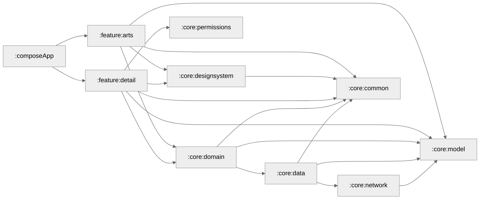

# Custom Switch

**Custom Switch** is a highly customizable Android library that allows you to fully customize the appearance and behavior of a switch. You can change the ON/OFF thumb icon, background color, label color, and more.

[](https://jitpack.io/#JayeshInfyom/CustomSwitch)

## Features
- Fully customizable switch thumb icon for ON/OFF states.
- Customizable background color.
- Customizable label color.
- Easy integration with Gradle.
- Lightweight and optimized for performance.

## Installation

Add the JitPack repository to your `settings.gradle.kts` file:

```gradle
dependencyResolutionManagement {
    repositoriesMode.set(RepositoriesMode.FAIL_ON_PROJECT_REPOS)
    repositories {
        mavenCentral()
        maven { url = uri("https://jitpack.io") }
    }
}
```
Add the JitPack repository to your `build.gradle.kts` file:

```gradle
dependencies {
    implementation("com.github.JayeshInfyom:CustomSwitch:1.0.0")
}
```
## Usage

Add the CustomSwitch to your layout file:

```xml
 <com.example.infyomswitch.View.InfyomSwitch
       android:id="@+id/toggleView"
       android:layout_width="wrap_content"
       android:layout_height="wrap_content"
       android:layout_margin="@dimen/_10sdp"
       app:on="true"
       app:textOn="OFF"
       app:textOff="ON"
       app:textOnColor="@color/white"
       app:textOffColor="#A4A4A4"
       app:colorOff="@color/colorAccent"
       app:colorOn="#D9D8D8"
       app:thumbOffIcon="@drawable/ic_thumb_off"
       app:thumbOnIcon="@drawable/ic_thumb_on"
       />

```

## Graph Of App Screen


